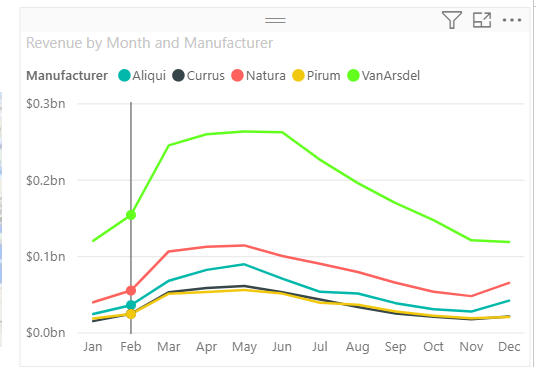
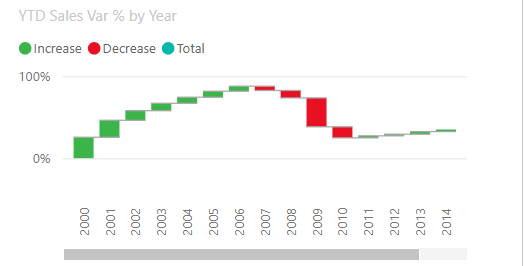
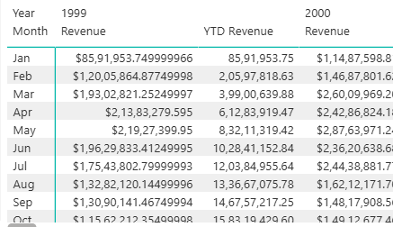
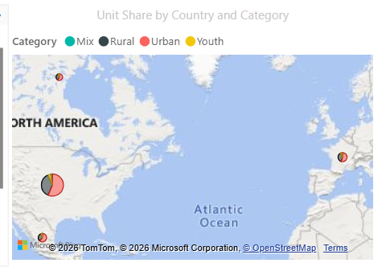
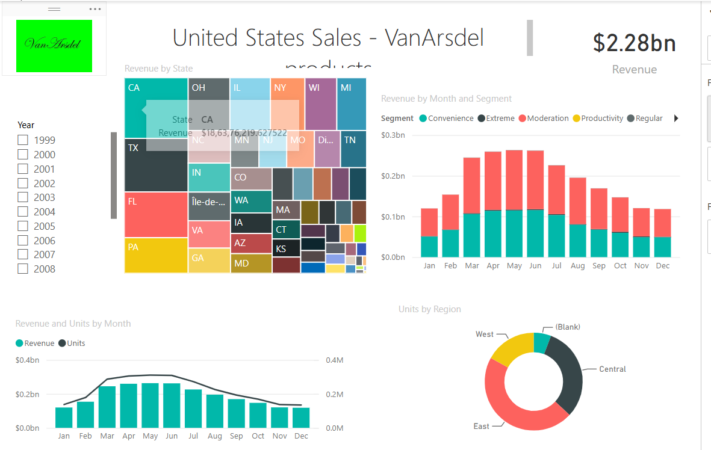
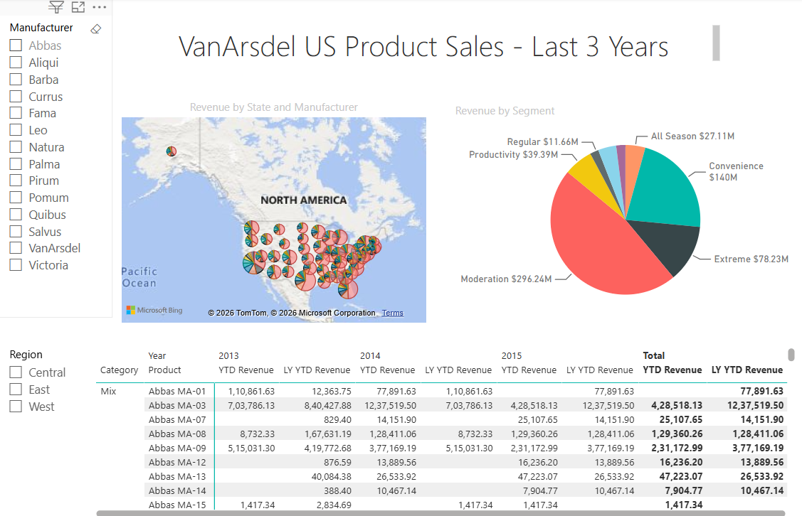

 # Executive Business Intelligence Dashboard
 

## 📌 Project Overview

This project is a professional Power BI Executive Business Intelligence Dashboard designed to help organizations monitor sales performance, revenue trends, customer insights, and executive KPIs through interactive visualizations.

---

## 🎯 Business Objective

The objective of this dashboard is to provide executives and decision-makers with a centralized reporting solution that enables:

- Sales Performance Monitoring
- Revenue Analysis
- Customer Insights
- Product Performance Analysis
- Regional Performance Tracking
- Executive KPI Reporting

---

## 📊 Dashboard Features

- Executive KPI Cards
- Interactive Filters & Slicers
- Revenue Analysis
- Sales Trend Analysis
- Product Performance
- Customer Analytics
- Regional Performance
- Dynamic Charts
- Drill-down Analysis

---

## 🛠️ Technology Stack

- Power BI
- Power Query
- DAX
- Data Modeling
- Microsoft Excel

---

## 📂 Repository Structure

```text
Dashboard/
Dataset/
Images/
Documentation/
```

---

## 📸 Dashboard Preview
  

### Executive Dashboard Overview



---

### Sales Performance Dashboard



---

### Customer Insights Dashboard



---

### Product Performance Dashboard



---

### Regional Sales Dashboard



---

### Executive KPI Dashboard



### Executive Dashboard


### Sales Analysis


### Customer Analysis


### Product Performance


### Regional Analysis


### KPI Overview


---

## 📁 Dataset

The dataset used for this dashboard is available inside the **Dataset** folder.

---

## 📄 Documentation

Additional documentation is available in the **Documentation** folder.

---

## 🚀 Future Improvements

- Forecasting
- AI Insights
- Row-Level Security
- Mobile Layout
- Advanced DAX Measures
- Performance Optimization

---

## 👨‍💻 Author
@raghuveer-excel
